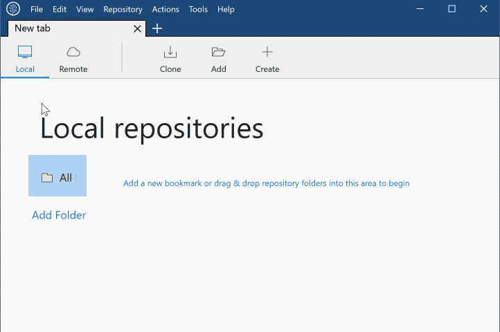

# Git-101: An Introduction to Git using SourceTree

## Module 0: Setup Git, SourceTree, and Github

In this module we will install SourceTree and configure a GitHub account as pre-requirements to run through modules 1-5.

### Install SourceTree

In this tutorial we will use SourceTree as a graphical way to interact with Git.  SourceTree is a easy to use graphical GitHub client that is made by Atlassian.  It makes working with Git easy as it comes packaged with Git. We will quickly install it here. *Note: it is important to know that Git is a command line tool and everything that we do via SourceTree is able to be done within the command line or CLI.*

1. Head to [https://www.sourcetreeapp.com](https://www.sourcetreeapp.com) and download SourceTree for your system.
1. Open and follow the installation instructions.
1. Choose to use the built in GIT if asked.
1. Skip the step if asked to configure a GitHub account with SourceTree.

### Setup a GitHub Account

We will utilize GitHub throughout this tutorial and you will need a GitHub account to continue.  If you already have a GitHub account you can utilize that and skip this step.

1. Start by heading to [https://github.com/join](https://github.com/join).
1. Create a Username and Password and fill in your email address.
1. Choose the Unlimited public repositories for free account plan.
1. Verify your email address by checking your email and clicking the link do do so.

### Connect SourceTree to GitHub

You need to now connect your GitHub account to SourceTree to be able to push and pull changes from your files and repositories to GitHub from SourceTree.  *Note: This entire tutorial is written for Windows, SourceTree on Mac should function very similar, but could be slightly different in the location of the buttons/commands.*

1. Start by opening SourceTree and clicking Remote at the top left.
1. Click Add an Account.
1. Choose GitHub for the Hosting Service.
1. Click on Refresh OAuth Token.
1. Login with your GitHub credentials.
1. Click accept to authorize SourceTree (Atlassian) with GitHub.

[Continue on to Module 1](./Module-1)

## Table of Contents

1. [Module 0: Setup Git, SourceTree, and Github](./Module-0)
1. [Module 1: Create a new Repository](./Module-1)
1. [Module 2: Adding and Staging Changes](./Module-2)
1. [Module 3: Committing and Sharing Changes (*Pushing*)](./Module-3)
1. [Module 4: Branching, Merging, and Reverting](./Module-4)
1. [Module 5: Cloning and Forking](./Module-5)