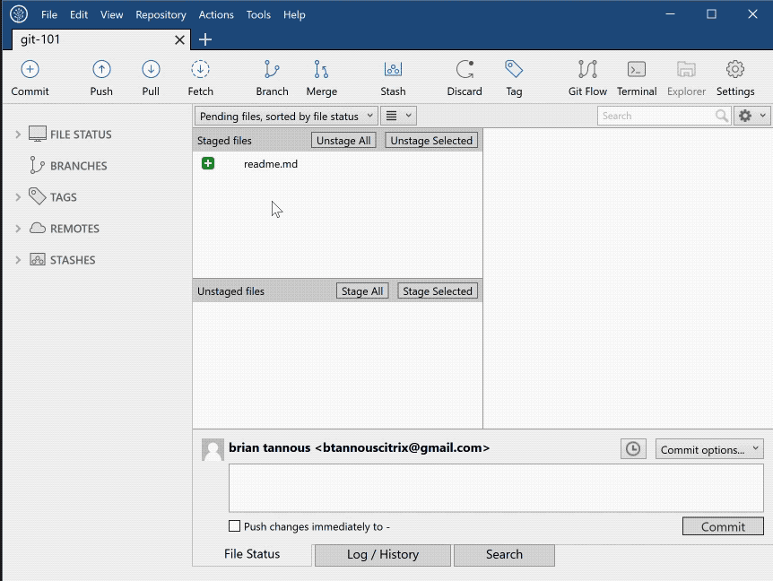

# Git-101: An Introduction to Git using SourceTree

## Module 3: Committing and Sharing Changes (*Pushing*)

In this module we will commit the first readme.md file that we created. We will push those changes to GitHub for the public to enjoy.

The basic GIT workflow is as follows: Create repository -> create or copy over files -> stage them to be saved at their current state -> **commit them -> share the commit with your team** -> work on new ideas or sections of the project -> merge them back with the original branch -> repeat.

### Committing

In this tutorial we will use SourceTree to graphically commit the change that we staged in the [previous module](./Module-2). Committing our changes allows Git to keep a point in time record of the state of the files within the repository. Doing this allows our teammates to work on the same files and always have a master copy of the changes.

1. Verify that your readme file is currently in the staging area within SourceTree.
1. Type an useful commit message that describes what happened in this commit. When working in a team you will want to be sure that you leave a commit message that allows your team to understand what you did within the commit so be as detailed as possible. A good example for this commit would be: `This is the first commit. I added the readme file for the project.`
1. Click Commit to finalize your changes.

> A good tip is to make sure that you preform commits often. Think of it as the save button while working on a file.

### Pushing

In this section we will upload or push the changes and commits we made to the files to GitHub. Pushing is an important aspect of Git as it sends our changes we made to the central remote repository for others to use.

1. Within SourceTree click on the Push button on the top bar.
1. Choose to push the master branch of our project.
1. SourceTree will now begin to upload your commits to your remotes, or GitHub in our case.
1. If prompted be sure to login to GitHub.
1. Once done check that the remote/master branch and the master branch are the same by expanding **Branches -> Master** on the left.

Pulling is not preformed in this lab, but if you were working on a team and you wanted to update your local version of the Git repository you would download the latest commits from the repository by clicking Pull.

[Continue on to Module 4](./Module-4)

## Table of Contents

1. [Module 0: Setup Git, SourceTree, and Github](./Module-0)
1. [Module 1: Create a new Repository](./Module-1)
1. [Module 2: Adding and Staging Changes](./Module-2)
1. [Module 3: Committing and Sharing Changes (*Pushing*)](./Module-3)
1. [Module 4: Branching, Merging, and Reverting](./Module-4)
1. [Module 5: Cloning and Forking](./Module-5)