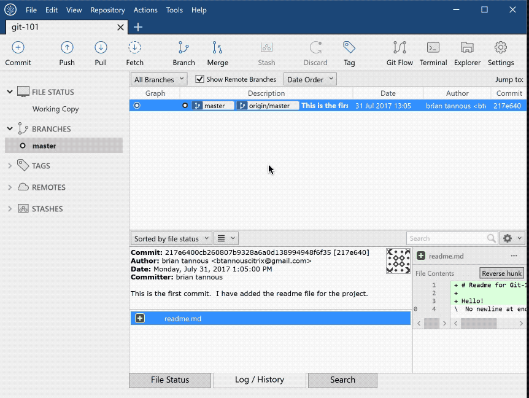
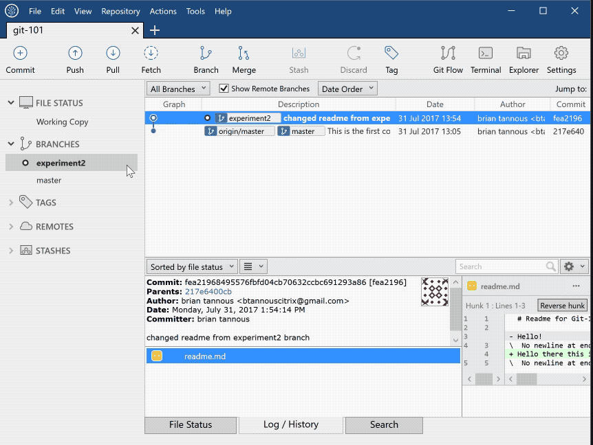

# Git-101: An Introduction to Git using SourceTree

## Module 4: Branching, Merging, and Reverting

In this module we will explain and show you the importance of being able to branch, merge, and revert your current state of your repository.

The basic GIT workflow is as follows: Create repository -> create or copy over files -> stage them to be saved at their current state -> commit them -> share the commit with your team -> **work on new ideas or sections of the project -> merge them back with the original branch -> repeat**.

### Branching

Branching within Git allows us to work on our own section of the project without effecting anything on the main branch called Master. This allows us to work on a project within a team and add new modules or sections to our project in an organized manor.

1. To create a new branch within SourceTree click on the Branch button in the top bar.
1. Fill in `experiment2` for the New Branch name.
1. Click Create Branch



We will now make a quick change to the readme file within the new branch. *Typically within a new branch you will make many more changes than this quick change.*

1. First verify we are working on the `experiment2` branch by making sure that is is bolded below the Branches tab.
1. Click on the Explorer button to open up the directory for our repository.
1. Open readme.md and modify it as follows:

```markdown
# Readme for Git-101

Hello there this is my latest update from branch exp2!
```

1. Save the readme and close it. Head back to SourceTree.
1. Stage the readme file.
1. Click Commit and type out a commit message.
1. Click Commit.


### Merging

Merging allows us to take our current changes within a branch and apply them to another branch. We will merge our experiment2 branch with the main Master branch in this example.

1. Within SourceTree double click on the **master** branch under **Branches** to checkout that branch.
1. Click on Merge in the top menu.
1. Select the **experiment2** branch and click **OK** to merge your changes.
1. The master branch now is the same as the experiment2 branch, all of our changes have been merged together.



### Reverting

Reverting allows us to move our current state of the repository back to a commit that happened previously. If you follow best practice by committing often you will have a few commits to choose from, or a larger history of what happened. Reverting is highly valuable if you or a teammate made a mistake and you would like to roll their changes back.

1. Within SourceTree right click on the latest commit where master is equal to excitement2.
1. Select Reverse commit
1. Choose Yes to verify that you would like to roll back the latest commit to the master branch.
1. You can inspect the changes to our latest commit by looking at the lower right pane and seeing the differences in the readme file.
1. We now should push our changes to GitHub. Click on Push from the top menu.
1. Here you can decide to push the experiment2 branch or only update the master. In our case we will only update the master by clicking Push.
1. Our changes will be uploaded to our remote repository, GitHub.


[Continue on to Module 5](../Module-5)

## Table of Contents

1. [Module 0: Setup Git, SourceTree, and Github](../Module-0)
1. [Module 1: Create a new Repository](../Module-1)
1. [Module 2: Adding and Staging Changes](../Module-2)
1. [Module 3: Committing and Sharing Changes (*Pushing*)](../Module-3)
1. [Module 4: Branching, Merging, and Reverting](../Module-4)
1. [Module 5: Cloning, Forking and Pull Requests](../Module-5)