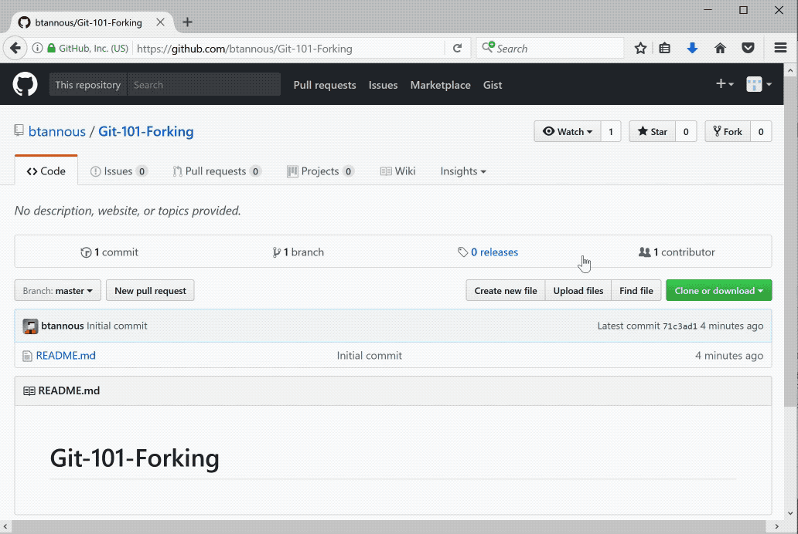
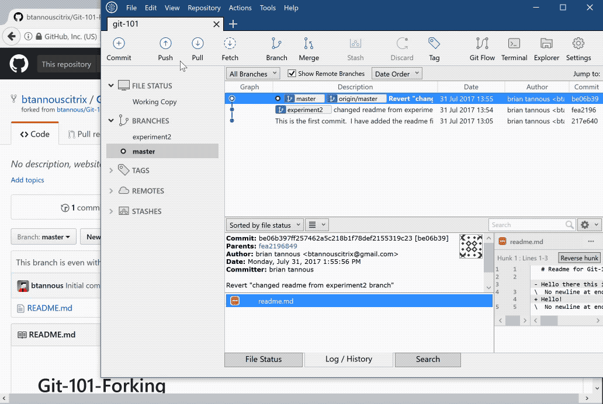
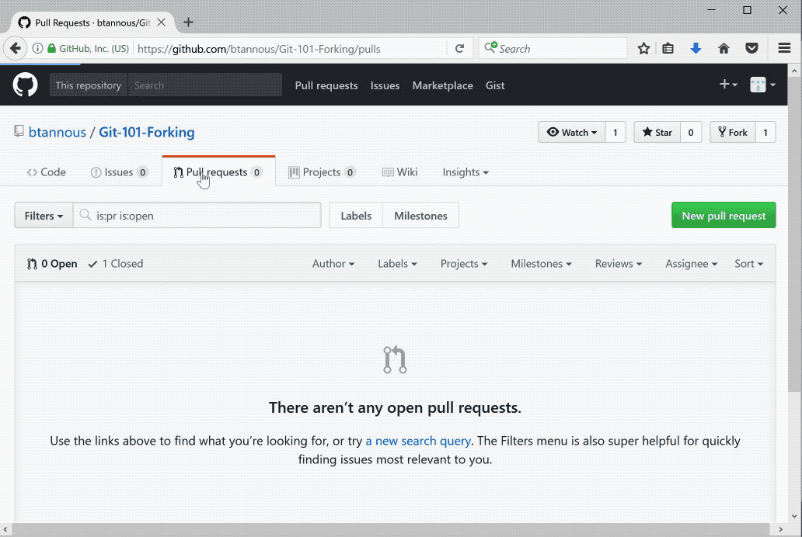

# Git-101: An Introduction to Git using SourceTree

## Module 5: Cloning, Forking, and Pull Requests

In this module we will use Git's Cloning, Forking, and Pull Request functionality. These tools allow us to use a project **(cloning)**, copy another project as our own **(forking)**, and request to apply changes back to the first repository that we copied our project from **(Pull Requests)**.

### Forking

In this section we will initiate a fork. Forks allow us to take an already existing project and copy it as ours. This allows us to make any changes we would like to make to our own repository of the project.

1. Open a web browser and head to [https://github.com/btannous/Git-101-Forking](https://github.com/btannous/Git-101-Forking)
1. Click on the Fork button at the top right of the page.

### Cloning

Now that we have forked the Git-101-Forking repository online at GitHub we need to Clone the Repository locally. Cloning allows us to copy the entire repository locally for storage or to allow us to contribute to it.

1. Within SourceTree click on the Plus (+) button to add a new Tab.
1. Click on Remote
1. Choose to Clone the Git-101-Forking repository. *If you do not see this repository within your GitHub remote click on the refresh button.*
1. Choose Clone.
1. SourceTree will clone the repository locally.

1. Next we will make a change to the freshly cloned repository.
1. Click on the Explorer button on the top bar to open the directory of our repository.
1. Open the readme.md file.
1. Add a note to the bottom of the readme and save it.
1. Head back to SourceTree to Commit and Push your changes back to GitHub using what you learned in [Module 3](../Module-3)

### Pull Requests

Pull Requests allow you to contribute your changes in your fork of a repository to another, commonly the original repository. We will initiate a pull request to the repository we originally forked ours from.

1. Head to the original Git-101-Forking repository here: [https://github.com/btannous/Git-101-Forking](https://github.com/btannous/Git-101-Forking).
1. Click on Pull Requests.
1. Click on New Pull Request.
1. Click on Compare across Forks.
1. Select your fork as the Head Fork.
1. Click Create Pull Request.
1. You can leave a comment (optional) and click Create Pull Request to submit your request.

1. After the contributors to the base fork approve your pull request you will be able to see your changes applied.

## Further Reading and Citations

[https://www.quora.com/What-is-git-and-why-should-I-use-it](https://www.quora.com/What-is-git-and-why-should-I-use-it)  
[https://www.atlassian.com/git/tutorials/what-is-git](https://www.atlassian.com/git/tutorials/what-is-git)  
[http://rogerdudler.github.io/git-guide/](http://rogerdudler.github.io/git-guide/)  
[http://cs.co/git-us2017](http://cs.co/git-us2017)

## Table of Contents

1. [Module 0: Setup Git, SourceTree, and Github](../Module-0)
1. [Module 1: Create a new Repository](../Module-1)
1. [Module 2: Adding and Staging Changes](../Module-2)
1. [Module 3: Committing and Sharing Changes (*Pushing*)](../Module-3)
1. [Module 4: Branching, Merging, and Reverting](../Module-4)
1. [Module 5: Cloning, Forking and Pull Requests](../Module-5)