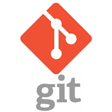

# Git-101: An Introduction to Git using SourceTree

## Table of Contents

1. [Module 0: Setup Git, SourceTree, and Github](./Module-0)
1. [Module 1: Create a new Repository](./Module-1)
1. [Module 2: Adding and Staging Changes](./Module-2)
1. [Module 3: Committing and Sharing Changes (*Pushing*)](./Module-3)
1. [Module 4: Branching, Merging, and Reverting](./Module-4)
1. [Module 5: Cloning and Forking](./Module-5)

## Introduction

Git is a Version Control Software that allows a team of people to work together, all using the same files. And it helps the team cope with the confusion that tends to happen when multiple people are editing the same files.

Version control systems are a category of software tools that help a content creators and teams manage changes to files over time. Version control software keeps track of every modification to the text file in a special kind of database. If a mistake is made, the creator can turn back the clock and compare earlier versions of the code to help fix the mistake while minimizing disruption to all team members.

## Further Reading and Citations

[https://www.quora.com/What-is-git-and-why-should-I-use-it](https://www.quora.com/What-is-git-and-why-should-I-use-it)  
[https://www.atlassian.com/git/tutorials/what-is-git](https://www.atlassian.com/git/tutorials/what-is-git)  
[http://rogerdudler.github.io/git-guide/](http://rogerdudler.github.io/git-guide/)  
[http://cs.co/git-us2017](http://cs.co/git-us2017)